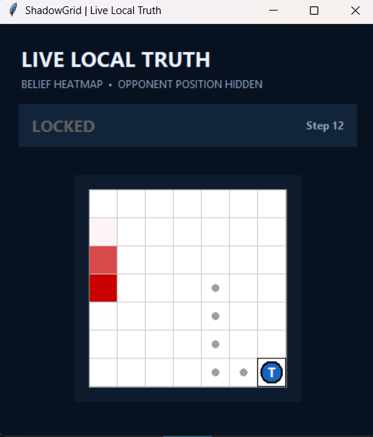
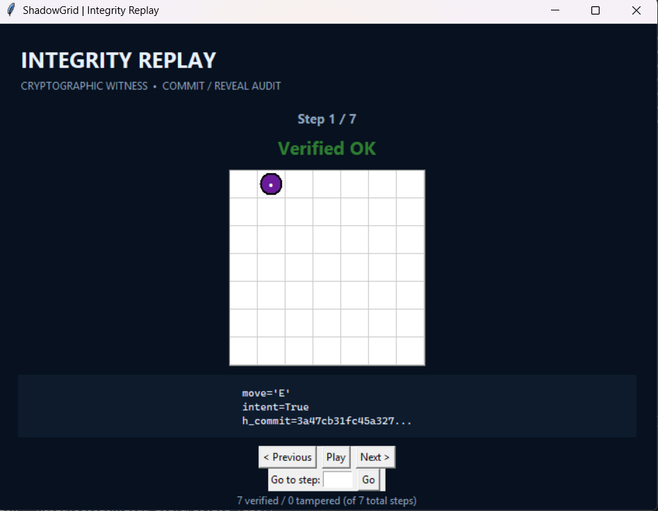
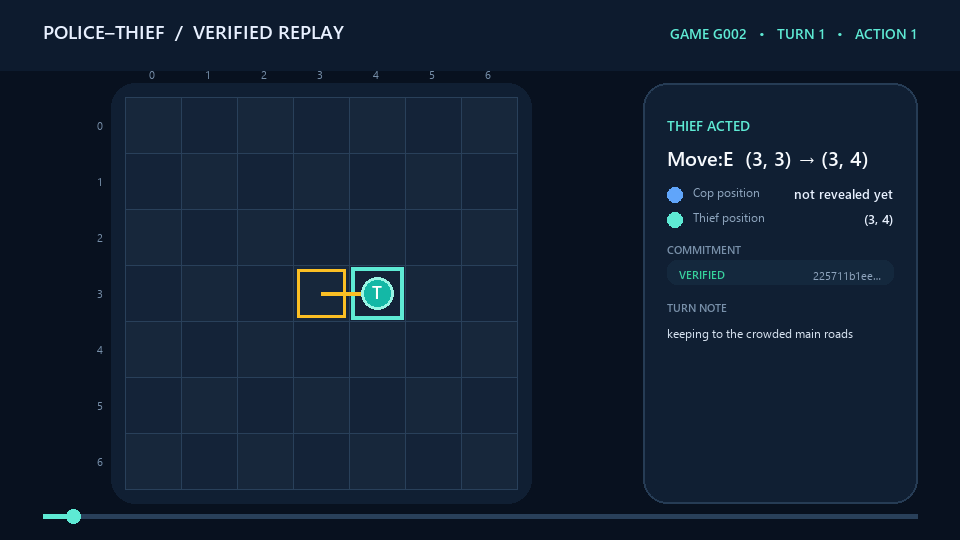
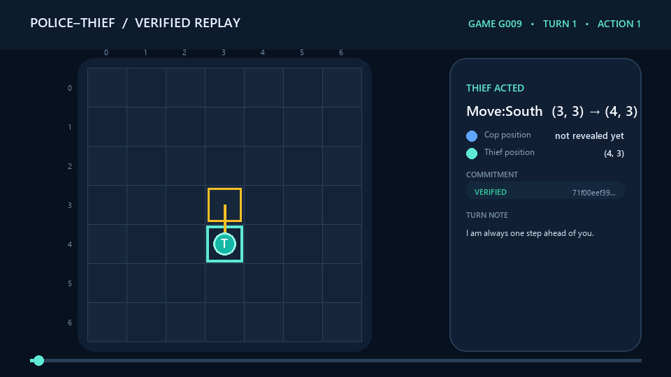

# Police–Thief P2P · Cop Agent

> A decentralized pursuit agent that hunts under uncertainty, engineers the board with barriers, proves every move cryptographically, and completes matches without a central referee.

[](https://www.python.org/)
[](https://docs.astral.sh/uv/)
[](https://gofastmcp.com/)
[](https://docs.astral.sh/ruff/)

This is the **cop-side repository** for the University of Haifa **Orchestration of AI Agents** final project (AY26). Its companion is the [thief repository](https://github.com/aishadahesh/uoh-ay26-final-project-thief).

The two applications are deliberately separate. Each process owns its private state, exposes a FastMCP endpoint, calls the opponent as an MCP client, validates the same signed rules, and independently derives the final result. There is no game server with privileged truth and no shared memory between agents.

## Abstract

This repository presents an evidence-driven autonomous pursuer for a decentralized, partially observable grid game. The engineering problem is broader than shortest-path search: two independently operated agents must coordinate turns over an unreliable public network, preserve private state during play, resist retrospective tampering, and still derive the same result without a trusted referee. The implementation therefore combines a probabilistic opponent model, deterministic legal-action and barrier analysis, bounded Gemini assistance, FastMCP orchestration, SHA-256 commit–reveal records, Step-0 environment attestation, mutual replay audit, and machine-readable reporting.

The central design claim is that competitive strength and protocol integrity should reinforce one another. The Cop pursues a belief distribution rather than hidden truth; every proposed action is checked by deterministic board physics; and every outcome remains traceable to signed, replayable evidence. Six counted six-sub-game series against independent teams provide the empirical basis reported below. Both a successful capture and a failed pursuit are retained as reproducible artifacts so the report documents capability and limitation with equal transparency.

### Contributions

- A role-isolated Cop process that operates without access to the Thief's private state or implementation.
- An interpretable pursuit policy combining belief peaks, legal-path pressure, anti-oscillation penalties, escape-space analysis, and selective barrier placement.
- A fail-closed peer protocol that binds rules, identity, code revision, moves, claims, and final consensus to auditable records.
- A reproducibility package containing paired signed JSON logs and generated GIFs for one Cop win and one Cop loss.
- Empirical evaluation across 18 counted sub-games with mutually confirmed aggregate outcomes.

## Why this project is interesting

A normal board game can ask a referee whether a move is legal. This project cannot. The cop must simultaneously solve four problems:

- **Reason under partial observability:** infer the thief from scent evidence rather than reading its coordinates.
- **Pursue intelligently:** close distance while placing barriers only when they reduce escape space.
- **Coordinate without trust:** exchange turns over a peer-to-peer protocol while preventing retroactive move changes.
- **Produce auditable evidence:** save declarations, configuration snapshots, sealed logs, scores, and optional Gmail reports.

The result is part game agent, part distributed system, and part cryptographic audit pipeline.

## Contents

- [System at a glance](#system-at-a-glance)
- [Formal problem formulation](#formal-problem-formulation)
- [Required interface evidence](#required-interface-evidence)
- [Cop intelligence](#cop-intelligence)
- [Gemini integration](#gemini-integration)
- [Trust and protocol design](#trust-and-protocol-design)
- [Installation](#installation)
- [Run modes](#run-modes)
- [Animated game replay for the README](#animated-game-replay-for-the-readme)
- [Two-computer match guide](#two-computer-match-guide)
- [Verified match history](#verified-match-history)
- [Experimental methodology](#experimental-methodology)
- [Configuration](#configuration)
- [Results and automatic email](#results-and-automatic-email)
- [Testing and quality](#testing-and-quality)
- [Project map](#project-map)
- [Troubleshooting](#troubleshooting)
- [Academic design notes](#academic-design-notes)
- [Limitations and future work](#limitations-and-future-work)
- [Recommended self-score for submission](#recommended-self-score-for-submission)

## System at a glance

```text
┌──────────────────────── COP PROCESS ────────────────────────┐
│ local board + belief map + cop strategy + private nonce     │
│                                                             │
│  observe scent → update belief → choose legal move          │
│       ↓                          ↓                           │
│  barrier analysis          commit SHA-256                   │
│       ↓                          ↓                           │
│  local audit log   ← FastMCP P2P →   opponent peer          │
└─────────────────────────────────────────────────────────────┘
              ↓ final mutual audit and sign-off
       result JSON → optional Gmail gatekeeper → recipient
```

The implementation is divided into four layers:

| Layer | Responsibility |
|---|---|
| `domain/` | Board physics, scent, beliefs, capture, scoring, replay, strategy |
| `services/` | MCP transport, wire protocol, commit–reveal, reliability, reporting |
| `gui/` | Interactive game, live board, setup flow, replay viewer |
| `shared/` | Configuration loading, constants, validation, versioning |

## Formal problem formulation

We model the match as a finite-horizon Dec-POMDP

```text
M = ⟨I, S, {Aᵢ}, T, R, {Ωᵢ}, O, H⟩
```

where `I = {cop, thief}`, `S` contains both positions, the public barrier set, turn index, role budgets, and terminal status, and `H = 35` is the survival horizon. The Cop action set contains legal orthogonal moves, `STAY`, and rule-compliant barrier placement. `T` is deterministic once both legal actions are fixed, while `R` is asymmetric: capture rewards the Cop and survival rewards the Thief.

The Cop does not observe the full state. Its local observation `o_c ∈ Ω_c` contains its own position, shared board geometry, signed public declarations, scent evidence, and protocol events—but not the Thief's hidden coordinate. A normalized belief `b_c(s)` is therefore maintained over feasible Thief cells. Decision quality is evaluated against this belief, while legality is evaluated against the deterministic local board. This separation prevents an inference from silently becoming privileged ground truth.

No reinforcement-learning policy was trained for this implementation, so learning curves are not applicable. The selected method is an interpretable Bayesian/heuristic controller augmented by a constrained language-model advisor. Its advantages are deterministic fallback, direct testability, and per-turn explanations that can be compared with replay evidence.

Scent supplies the observation likelihood. For decay rate `ρ = 0.10`, the shared field follows

```text
τᵢⱼ(t+1) = max(0, (1 - ρ)τᵢⱼ(t) + Δτᵢⱼ)
b'(s) ∝ Predict(b)(s) · (τ(s) + ε)
```

with center intensity `0.9` and a `5 × 5` footprint. The prediction term first propagates probability through every legal one-step transition; the likelihood term then weights feasible cells by observed scent. Blocked cells are removed and the posterior is normalized. Verbal hints may inform tactical reasoning, but cannot replace this physical evidence or legal transition model.

## Required interface evidence

The Live GUI exposes only the running agent's local truth and its belief heatmap; the hidden opponent coordinate is not rendered. The screenshot below was captured from the shared presentation layer during a Thief-role run, which is why the local marker is `T`; the same belief-map component is used by the Cop process.



The Replay Viewer independently recomputes commitments and displays the integrity verdict. `Verified OK` is derived from the supplied log rather than hard-coded presentation text.



## Cop intelligence

### 1. Belief before movement

The cop never reads the thief’s real position. `BeliefMap` maintains a probability distribution over open cells and updates it from the thief’s decaying scent field. Blocked cells receive no probability mass, and the posterior is normalized after every update.

The strongest cell, `belief.arg_max()`, is a hypothesis—not privileged truth.

### 2. Pursuit policy

`ManhattanHeuristicBrain` evaluates legal orthogonal moves and chooses one that decreases the Manhattan distance to the current belief peak:

```text
D(cop, target) = |row_cop - row_target| + |col_cop - col_target|
```

The deterministic board engine remains authoritative. Out-of-bounds moves and movement into blocked cells are rejected before execution.

### 3. Spatial engineering with barriers

Movement catches up; barriers change the future. On its turn, the cop chooses either to move or to forfeit movement and place one public barrier on its current or an orthogonally adjacent cell. The strategy examines candidates, uses focused fresh scent evidence to challenge an adjacent suspected cell or close a shared escape flank, and otherwise favors placements that shrink the reachable region around the believed thief. Every proactive placement preserves at least two Police exits, so containment cannot turn into self-confinement.

This gives the cop several tactical modes:

- direct interception when belief confidence is strong;
- chokepoint closure when a barrier disconnects meaningful space;
- escape-route compression near borders and corners;
- boxed-in capture when no legal escape remains;
- budget preservation when a barrier has no immediate strategic value.

Barrier declarations are intentionally public. Both peers apply the same placement immediately, keeping their independent board models synchronized.

### 4. Capture resolution

Capture is established by a valid post-move Capture Claim confirmed truthfully by the Thief, or by a separate protocol-defined boxed-in/illegal-escape terminal condition. Coordinate equality without the required claim/response is nonterminal. Both peers must agree on the audited outcome before the result receives mutual sign-off.

## Gemini integration

Gemini is a tactical advisor, not a replacement for the rules engine.

For agent-driven modes, Gemini receives only local, permitted context:

- role and current turn;
- the cop’s own position;
- the belief-map peak;
- the exact set of legal moves;
- barrier budget and match horizon;
- a strict expected response format.

The response is parsed and checked against the legal action set. Invalid output, timeouts, unavailable models, or malformed responses activate the deterministic strategy. Gemini never gets permission to bypass `Board.apply_move`, fabricate diagonal movement, or mutate hidden opponent state.

Configure it in `.env`:

```env
GEMINI_API_KEY=your_google_ai_studio_key
GEMINI_MODEL=gemini-3.1-flash-lite
GEMINI_TIMEOUT_SECONDS=8
GEMINI_ENABLE_MODEL_FALLBACKS=false
```

Human-vs-human mode does not require an API key.

## Trust and protocol design

### Fail-closed pre-game rules gate

Before either peer sends `READY` or executes a move, both sides now exchange and validate a redacted conformance manifest. The validator uses the official project definition as its canonical policy, not merely the opponent's copy. It strictly checks the complete `config/game.json` schema, types, allowed fields, protected board and scoring values, legal actions, initial positions, six-game series size, checksums, role pairing, sub-game number, and the shared timeout agreement.

The opponent's active public GitHub repository is pinned to its announced 40-character commit. At that immutable revision the gate verifies `config/game.json`, confirms that `config/game.toml` and the required project documentation exist, and checks protected rule values. Only a redacted public TOML projection crosses the wire: team identity, repository links, sub-game number, and shared timeout. Strategy settings, prompts, Gemini configuration, credentials, email details, ports, and opponent URLs remain private and are never inspected or transmitted.

Every attempt creates `results/network/validation_<game-id>_gNN.json`. A passing report records policy and file checksums plus repository checks. A failure records the exact file and field, error code, expected value, and received value; the process stops before declarations, `READY`, turns, or result generation.

### Peer-to-peer FastMCP

Every participant is both server and client. The reference protocol exposes four operations:

1. `negotiate` — exchange signed terms and peer identity;
2. `receive_turn` — deliver sealed turn data and public declarations;
3. `submit_audit` — exchange complete reveal records at match end;
4. `receive_control` — communicate readiness, state, and completion.

### Commit–reveal

A turn is sealed with a private nonce:

```text
commit = SHA256(state || move || intent || nonce)
```

The nonce is withheld during play. At final audit, each peer reveals its records and the opponent recomputes every commitment. Changed moves, intents, state snapshots, or nonces fail verification.

### Step-0 fairness declaration

Before gameplay, each side seals a system declaration containing identity, code/config evidence, hardware information, and model metadata. This makes the match environment part of the evidence rather than an unverifiable afterthought.

### Reliability boundaries

Timeouts, state transitions, peer messages, and reporting are explicitly bounded. The game state machine rejects illegal transitions; malformed wire messages fail validation; completed result files are preserved even when a later reporting operation fails.

## Installation

Requirements:

- Python 3.11 or newer;
- [`uv`](https://docs.astral.sh/uv/);
- Tk support for GUI modes;
- a Gemini key for agent modes;
- Google OAuth credentials only when Gmail reporting is enabled.

```bash
git clone https://github.com/aishadahesh/uoh-ay26-final-project-cop.git
cd uoh-ay26-final-project-cop
uv sync
```

Create local environment settings:

```powershell
Copy-Item .env-example .env
```

Never commit `.env`, `credentials.json`, or `token.json`.

## Run modes

### Interactive command center

```bash
uv run python -m police_thief play
```

Available modes include human-vs-human, human-vs-agent, local agent-vs-agent, and two-computer MCP play.

### Standalone visualization

```bash
uv run python -m police_thief demo
```

Opens the belief/scent visualization without requiring a network opponent.

### Local simulation

```bash
uv run python -m police_thief simulate
```

Runs the board, movement, scent, capture, and scoring pipeline in one process.

### Real peer

```bash
uv run python -m police_thief peer --role police
```

Starts a role-safe six-game coordinator. It launches a fresh Cop process for games 1/3/5 and a fresh process from the sibling Thief repository for games 2/4/6, advances the sub-game number, preserves verified completed games when resuming, and performs final series consensus after game 6. Neither child process changes role or reads the sibling role's private configuration.

### Replay an audited log

```bash
uv run python -m police_thief replay --log results/log_G009_g01.json
```

The replay viewer recomputes commitments and clearly distinguishes verified from tampered logs.

## Animated game replay for the README

`scripts/visualize_game_log.py` converts a signed network log into a cryptographically annotated GIF or MP4. It understands current wrapped audit records and earlier state-string logs, verifies commitments, reconstructs movement and barriers, and marks capture claims and terminal events.

Generate a GIF from a saved log:

```powershell
uv run python scripts/visualize_game_log.py --input "assets/replays/cop-loss-G009-g01.json" --output "assets/replays/my-cop-replay.gif"
```

### Cop win — G002 sub-game 3

The Cop (`uoh-ay26`) completes the signed Capture Claim handshake after 15 steps against `amireman`.



Reproduce it from [`cop-win-G002-g03.json`](assets/replays/cop-win-G002-g03.json).

### Cop loss — G009 sub-game 1

The opponent Thief survives the full 35-step limit. The animation is kept because losses are useful strategy evidence, not hidden from the report.



Reproduce it from [`cop-loss-G009-g01.json`](assets/replays/cop-loss-G009-g01.json).

Both examples come from mutually verified counted-series evidence. The committed copies are intentionally isolated from the mutable `results/` workspace; their provenance and regeneration commands are recorded in [`assets/replays/README.md`](assets/replays/README.md). The full command reference is in [Running the project](docs/RUNNING.md#generate-a-replay-gif).

## Two-computer match guide

### Before launching

On both machines:

1. Run `uv sync`.
2. Copy `.env-example` to `.env` and configure Gemini.
3. Ensure both repositories use byte-identical `config/game.json` files.
4. Configure team identities, repository links, match ID, current sub-game number, secret, output directory, and email preference in `config/network_match.json`.
5. Set the cop’s opponent URL in `config/cop/game.toml`.
6. Start the project's **Cloudflare Tunnel (cloudflared)** for the local cop MCP port.

### Cloudflare Tunnel

This project uses **Cloudflare Tunnel (`cloudflared`)** to expose each local FastMCP server securely over HTTPS without opening an inbound router port. Start the cop application first, then open another terminal and publish port `8801`:

```bash
cloudflared tunnel --url http://127.0.0.1:8801
```

For a quick tunnel, `cloudflared` prints a temporary `https://<random>.trycloudflare.com` address. The MCP endpoint shared with the thief must append `/mcp`:

```text
https://<random>.trycloudflare.com/mcp
```

Put that full address in the thief peer's **Opponent public URL**. Put the thief's corresponding Cloudflare URL in this cop repository's opponent configuration. Keep the `cloudflared` process running for the entire match; restarting a quick tunnel generates a new URL that must be updated on the other peer.

A named Cloudflare Tunnel and custom hostname may also be used for a stable URL. Use the explicit IPv4 origin `http://127.0.0.1:8801`; this avoids a Windows `localhost` IPv6 mismatch when the server is listening only on IPv4.

### Launch order

Either peer may start first. Each waits at the negotiation boundary until the opponent is reachable:

```bash
# Our team starts from this repository when Cop plays sub-games 1/3/5
uv run python -m police_thief peer --role police

# If our team is Thief in sub-games 1/3/5, run this from the sibling Thief repository
cd ../uoh-ay26-final-project-thief
uv run python -m police_thief peer --role thief
```

The public command coordinates the full series automatically. Each child still handles exactly one fixed-role sub-game; the parent alternates between the independent repositories without sharing their private role configuration or process memory.

For the exact launch order, dual-hostname tunnel example, resume behavior, and pre-match checks, use [Running the project](docs/RUNNING.md). Before playing a new team, exchange every item in the [Opponent match guide](docs/OPPONENT_MATCH_GUIDE.md).

### Values that must agree

- shared `config/game.json` fingerprint;
- game and series identifiers;
- shared match secret;
- number of games and scoring rules;
- declared team/repository identities;
- each side’s expectation of the opponent.

Private API keys and OAuth tokens must never be shared.

## Configuration

| File | Visibility | Purpose |
|---|---|---|
| `config/game.json` | Shared | Board, scent, scoring, league, timing, and protocol parameters |
| `config/cop/game.toml` | Private | Cop port, opponent URL, role strategy, timeouts |
| `config/network_match.json` | Local launcher defaults | Teams, repositories, output, game identity, email switch |
| `.env` | Secret/local | Gemini and provider settings |
| `credentials.json` | Secret/local | Google OAuth client configuration |
| `token.json` | Secret/local | Reusable Gmail authorization token |

Treat the shared JSON as match law. Treat role TOML and secrets as local operational state.

## Verified match history

The team has completed **six counted six-sub-game series**. “Series W/L” is from `uoh-ay26`'s perspective.

| Series | Opponent | Series W/L | Sub-games won | Score | Mutual agreement |
|---|---|---:|---:|---:|---|
| G001 | `najamjad` | Loss | 0–6 | 30–90 | Confirmed |
| G002 | `amireman` | Win | 4–2 | 60–40 | Confirmed |
| G009 | `sharNamr` | Loss | 2–4 | 40–60 | Confirmed |
| `SMNGRP05-vs-uoh-ay26-C01` | `SMNGRP05` | Tie | 3–3 | 47–47 | Confirmed |
| `AHK-YOSI-vs-uoh-ay26-C001` | `ahk-yosi` | Win | 5–1 | 75–35 | Confirmed |
| `counted-2` | `yanell11` | Loss | 0–6 | 30–90 | Confirmed |
| **Total** | 6 opponents | **2–3–1** | **14–22** | **282–362** | 6 verified series |

The table is derived from the saved aggregate result JSON files, not from screenshots or memory. Friendly/non-counted verification runs are excluded.

## Experimental methodology

The empirical evaluation uses six counted series against six independently implemented opponent teams. Each series contains six sub-games with alternating roles. A row enters the table only after the local aggregate and the opponent's aggregate agree on all six outcomes, scores, winner, and consensus digest; friendly and aborted runs are excluded.

The primary outcome measures are sub-games won and role-correct score. Integrity is reported separately through mutual agreement rather than inferred from competitive outcome. This distinction matters: a legal loss with a verified audit is valid evidence, whereas an apparent win with unverifiable records is not. The 36-sub-game sample demonstrates cross-implementation compatibility and exposes strategy weaknesses, but it is too small and opponent-dependent to support a claim of statistical superiority.

The replay cases use the same signed JSON consumed by the audit path. The visualization script verifies commitments, reconstructs positions and public barriers, and renders the event sequence. The GIF is therefore an explanatory view; the adjacent JSON remains the reproducible evidence source.

## Results and automatic email

A completed series produces auditable artifacts such as:

```text
results/network/
├── declaration_G009.json
├── config_G009_g01.json
├── log_G009_g01.json
├── result_G009_g01.json
└── result_G009.json
```

Per-game files preserve the exact evidence for each sub-game; the aggregate result summarizes the complete series.

When automatic email is enabled, the final JSON is sent only after audit and mutual agreement. Delivery passes through:

- a quota manager;
- a token bucket;
- an anomaly detector;
- HTTP 429 retry/backoff;
- Gmail OAuth restricted to `gmail.send`.

The report is attached as JSON rather than rewritten as free text.

## Testing and quality

```bash
uv run pytest --cov
uv run ruff check .
uv run ruff format --check .
```

The suite covers pure domain behavior, configuration failures, cryptographic tampering, protocol validation, in-memory two-peer matches, real file round-trips, GUI state, Gemini boundaries, OAuth construction, rate limiting, and report schemas. External Gmail delivery and public tunnels remain manual integration boundaries.

Coverage is configured with an 85% floor in `pyproject.toml`. Honestly: the measured
total is ~81%, so the gate currently fails, and `ruff format --check` still reports
files it would reformat -- formatting was deliberately not applied wholesale before
submission to keep the final diffs reviewable. `ruff check .` passes clean.

## Project map

```text
src/police_thief/
├── domain/
│   ├── board.py              # movement and barriers
│   ├── belief.py             # probabilistic opponent model
│   ├── scent.py              # emission and decay
│   ├── capture.py            # capture and boxed-in rules
│   └── strategy/             # cop/thief decision policies
├── services/
│   ├── network_match.py      # full peer match orchestration
│   ├── network_protocol.py   # signed wire messages
│   ├── commit_reveal.py      # sealed turns and verification
│   ├── mcp_server.py         # inbound FastMCP tools
│   ├── mcp_client.py         # opponent calls
│   ├── gemini_agent.py       # bounded tactical advisor
│   └── network_reporting.py  # audited Gmail delivery
├── gui/                      # play, setup, board, replay
├── shared/                   # validated configuration
└── main.py                   # CLI entry point
```

Start with [Running the project](docs/RUNNING.md) and the [Opponent match guide](docs/OPPONENT_MATCH_GUIDE.md). Deeper engineering rationale lives in `docs/PRD_*.md`; the chronological build record is `ProgressDoc.md`.

## Troubleshooting

### Gemini key missing

Agent modes require `GEMINI_API_KEY` in `.env`. Human-vs-human remains available without it.

### Opponent is unreachable

Confirm `cloudflared` is running, the public URL ends with `/mcp`, `http://127.0.0.1:8801` is the tunnel target, and the remote FastMCP server is listening. HTTP 502 normally means the hostname reaches Cloudflare but the local origin is unavailable; 530/1033 means no connected tunnel route. Quick-tunnel URLs change whenever `cloudflared` restarts.

### Negotiation rejects the match

Compare both `config/game.json` files byte-for-byte and verify team identities, shared secret, game number, and repository URLs.

### Tkinter cannot find `init.tcl`

Install a Python distribution containing Tcl/Tk or repair the Tcl environment. CLI simulations and non-GUI tests can still run independently.

### Gmail dependencies or authorization fail

Run `uv sync`, verify `credentials.json` and `token.json` paths, and repeat browser consent if the cached token is invalid. The required scope is `https://www.googleapis.com/auth/gmail.send`.

### Result exists but email failed

The result is written before reporting. Inspect the emitted Gmail error and the saved JSON; do not replay the match merely to regenerate evidence.

## Academic design notes

### FastMCP orchestration dilemmas

The protocol has to solve a symmetry problem: each participant is simultaneously an MCP server, an MCP client, a strategist, and an auditor. Starting one role before the other, swapping repositories between sub-games, losing a tunnel route, or receiving a late final-audit envelope can otherwise create ambiguous ownership of progress. The implementation addresses this with explicit lifecycle states, bounded queues, retry windows, role-checked envelopes, independent per-sub-game processes, and a series coordinator that stops rather than fabricating later results.

The second dilemma is information timing. Revealing a move before its counterpart commits can create an unfair advantage; hiding everything until the end prevents necessary public board synchronization. The protocol therefore reveals only rule-mandated public data during play, seals private state with a nonce-backed SHA-256 commitment, and performs the full reveal during mutual audit. Capture remains a protocol event—post-move claim plus truthful response—not a retroactive conclusion from coordinates alone.

### Orchestrator and Gatekeeper responsibilities

The Orchestrator owns legal phase transitions: preflight, negotiation, Step-0 attestation, alternating turns, audit, consensus, artifact generation, and optional reporting. It does not decide what move is strategically best. The decision module proposes an action; the board validates and applies it; the protocol layer seals it.

The Gatekeeper protects external side effects. Shared configuration must pass canonical validation before play, peer identity must match the announced repository revision, token and deadline budgets are enforced, and Gmail delivery is rate-limited and restricted to an agreed final JSON. A reporting failure cannot rewrite a completed game. This separation keeps strategy errors, transport errors, audit errors, and reporting errors diagnosable at their own boundaries.

### Evidence and reproducibility

The repository keeps decision rationale readable, but it treats cryptographic records—not prose—as authoritative. Step-0 binds the environment and commit hash; turn records bind state, move, intent, and nonce; result claims are compared; and a canonical series digest binds the agreed adjudication facts. The two replay packages under `assets/replays/` make the evaluation inspectable without committing the working `results/` directories.

### Specification interpretations

Where examples and fixed tables differ, the official mandatory-parameters table is treated as authoritative. Capture is not inferred from coordinate coincidence alone: it requires the Police post-move landing, a Capture Claim for that cell, and the Thief's truthful `caught=true` response. To avoid missing a legal landing while preserving that handshake, the Cop emits a claim for its post-move cell on every Police turn. Step-0 is carried as a sealed `step: 0`, `type: "system_spec"` audit record, and final series agreement uses a separate empty-record consensus envelope so it cannot overwrite a completed sub-game outcome.

## Limitations and future work

- The belief update depends on the informativeness of the public scent field and can remain diffuse when evidence saturates.
- Heuristic barrier evaluation is interpretable but does not exhaustively solve the adversarial game tree.
- Public-tunnel availability remains an infrastructure dependency outside the core strategy.
- The counted evaluation spans six opponents and should be expanded before drawing broad performance conclusions.
- Two of the six retained bundles report a `derivation_mismatch` on `game_uid` under this repository's own `validate_submission_directory`, for two different reasons. `SMNGRP05-vs-uoh-ay26-C01` records the uid in the league interop-kit's *labeled* form, which folds the agreed `game_id` into the derivation; this repository's `derive_game_uid` predates that variant and derives the unlabeled form from the agreed terms and group IDs alone. `counted-2` records a uid that neither form reproduces from the terms committed alongside it. In both cases the bundle is internally consistent — every required attachment carries the same uid — and both peers confirmed the series consensus digest at match time, so the mismatch is between the recorded uid and this repository's local re-derivation, not between the two teams. The other four bundles validate cleanly here.
- Future work could compare the current controller with bounded-depth minimax, Monte Carlo tree search over beliefs, or a trained policy, while preserving the same legal-action and audit boundaries.

## Recommended self-score for submission

**Recommendation: 84 / 100 for the group.**

Per rule 55 (`docs/tasks.md` §11, line 839), this figure scores **code quality only and
deliberately ignores the league game outcome** — the 2–2–1 series record above played no part in
it. The weighting follows the four mandatory grading axes of Table 4 (§11.3.2), 25 points each.
Every deduction below names the open `docs/TODO.md` item that documents it, so the number can be
audited rather than taken on trust.

| Axis (Ch.) | Score | What earns it | What it loses |
|---|---:|---|---|
| **Coordination** (Ch.2) | 21 / 25 | Peer-to-peer FastMCP with no central referee; the four-tool contract; six counted six-sub-game series completed cross-machine over public tunnels with alternating roles and reciprocal consensus | The mid-match disconnect integration test does not pass in the cop repo (`T0522`, `T0622`); the slow-but-responsive opponent path is unit-tested only, never over real HTTP (`T0530`) |
| **Adaptation** (Ch.4, 6) | 20 / 25 | Pheromone emission/decay, a belief map that demonstrably drives move selection, a deterministic brain, and a standalone bluff classifier | Verbal hints are never fused into the belief map with a trust weight (`T0283`, `T0290`); no LLM sits on the per-step path — hints are template-generated at zero token cost (`T0328`); the per-series token budget is not enforced (`T0316`) |
| **Integrity** (Ch.5) | 23 / 25 | SHA-256 commit–reveal with end-game nonce reveal, mutual per-sub-game audit, signed Step-0 declarations, a reciprocal series consensus digest, and a submission validator that four of the six retained bundles pass cleanly | Two bundles fail the local validator on `game_uid` — `SMNGRP05-vs-uoh-ay26-C01` on the interop-kit's labeled form and `counted-2` on a uid this repository cannot re-derive from the committed terms (`T0898`); both-sides Gmail delivery is proven for G009 but not for every counted series (`T0866`, `T0737`) |
| **Architecture** (Ch.8, 10) | 20 / 25 | Gatekeeper and Orchestrator patterns, a real rate limiter, typed peer-client errors, and graceful degradation rather than crashes; 626 (cop) and 627 (thief) tests passing | Rule 3 is not satisfied — no single Orchestrator entry point fronts all sub-systems (`T0837`, found by our own review); line coverage is ~81% in both repos against the project's own 85% gate; rule 47's illegal-exit case is still unresolved, with `MoveRejectedError` propagating uncaught (`T0881`) |

### Why not higher, and why not lower

The case against a higher score is that three of the deductions are real engineering gaps rather
than paperwork: the missing single-Orchestrator entry point is a structural deviation from the
rulebook's own architecture rule that we found and chose to record instead of quietly restating the
requirement; the belief map never consumes verbal hints, so one full half of the Adaptation story
(scent *and* language) is only half-built; and a disconnect test that should prove the
technical-loss path currently fails.

The case against a lower score is that the mandatory end-to-end spine genuinely works and is
evidenced, not asserted. Six counted series against six distinct opponents were completed
cross-machine — against a `min_games_to_pass` of 2 — and each is retained as a signed, replayable
bundle whose scores were recomputed from the JSON for the table above rather than transcribed.
Where a requirement was not met, the repository says so in the open TODO item rather than
presenting it as done.

### Verification snapshot

These figures were measured, not estimated:

| Check | Cop repo | Thief repo |
|---|---|---|
| Test suite | 626 passed, 3 skipped, **1 failing** (`test_a_mid_match_disconnect_resolves_to_technical_loss_on_both_sides`) | 627 passed, 2 skipped, 0 failing |
| Line coverage | ~81% (gate: 85%) | 80.98% (gate: 85%) |
| Files within the 150-code-line guideline | all except `services/network_match.py` (~1976 code lines; documented exception, `T0899`) | all except `services/network_match.py` (~1970 code lines; documented exception, `T0899`) |
| Retained bundles passing `validate_submission_directory` | G001, G002, G009 pass; `SMNGRP05-vs-uoh-ay26-C01` fails on `game_uid` | `AHK-YOSI-vs-uoh-ay26-C001` passes; `counted-2` fails on `game_uid` |

Two further rulebook items are excluded from the score above because they are submission-time or
course-logistics actions rather than code quality: the annotated Git tag (`T0875`, rule 41) and the
Word/PDF per-member deliverables (`T0877`, `T0878`, rules 43–44).

## Credits and license

Built by **Aisha Abu Dahesh** and **Yousef Asadi** for the University of Haifa Orchestration of AI Agents course.

See [`LICENSE`](LICENSE) for educational-use terms. Course specifications and submission guidance remain the intellectual work of their respective authors.
