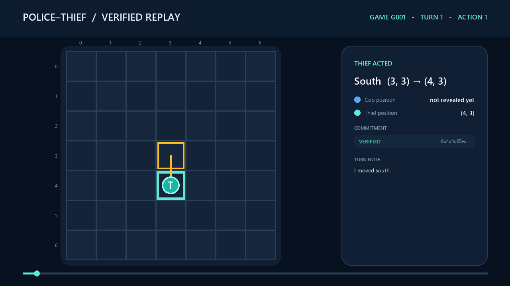

# Police–Thief P2P · Cop Agent

> A decentralized pursuit agent that hunts under uncertainty, engineers the board with barriers, proves every move cryptographically, and completes matches without a central referee.

[](https://www.python.org/)
[](https://docs.astral.sh/uv/)
[](https://gofastmcp.com/)
[](https://docs.astral.sh/ruff/)

This is the **cop-side repository** for the University of Haifa **Orchestration of AI Agents** final project (AY26). Its companion is the [thief repository](https://github.com/aishadahesh/uoh-ay26-final-project-thief).

The two applications are deliberately separate. Each process owns its private state, exposes a FastMCP endpoint, calls the opponent as an MCP client, validates the same signed rules, and independently derives the final result. There is no game server with privileged truth and no shared memory between agents.

## Why this project is interesting

A normal board game can ask a referee whether a move is legal. This project cannot. The cop must simultaneously solve four problems:

- **Reason under partial observability:** infer the thief from scent evidence rather than reading its coordinates.
- **Pursue intelligently:** close distance while placing barriers only when they reduce escape space.
- **Coordinate without trust:** exchange turns over a peer-to-peer protocol while preventing retroactive move changes.
- **Produce auditable evidence:** save declarations, configuration snapshots, sealed logs, scores, and optional Gmail reports.

The result is part game agent, part distributed system, and part cryptographic audit pipeline.

## Contents

- [System at a glance](#system-at-a-glance)
- [Cop intelligence](#cop-intelligence)
- [Gemini integration](#gemini-integration)
- [Trust and protocol design](#trust-and-protocol-design)
- [Installation](#installation)
- [Run modes](#run-modes)
- [Animated game replay for the README](#animated-game-replay-for-the-readme)
- [Two-computer match guide](#two-computer-match-guide)
- [Configuration](#configuration)
- [Results and automatic email](#results-and-automatic-email)
- [Testing and quality](#testing-and-quality)
- [Project map](#project-map)
- [Troubleshooting](#troubleshooting)
- [Academic design notes](#academic-design-notes)

## System at a glance

```text
┌──────────────────────── COP PROCESS ────────────────────────┐
│ local board + belief map + cop strategy + private nonce     │
│                                                             │
│  observe scent → update belief → choose legal move          │
│       ↓                          ↓                           │
│  barrier analysis          commit SHA-256                   │
│       ↓                          ↓                           │
│  local audit log   ← FastMCP P2P →   opponent peer          │
└─────────────────────────────────────────────────────────────┘
              ↓ final mutual audit and sign-off
       result JSON → optional Gmail gatekeeper → recipient
```

The implementation is divided into four layers:

| Layer | Responsibility |
|---|---|
| `domain/` | Board physics, scent, beliefs, capture, scoring, replay, strategy |
| `services/` | MCP transport, wire protocol, commit–reveal, reliability, reporting |
| `gui/` | Interactive game, live board, setup flow, replay viewer |
| `shared/` | Configuration loading, constants, validation, versioning |

## Cop intelligence

### 1. Belief before movement

The cop never reads the thief’s real position. `BeliefMap` maintains a probability distribution over open cells and updates it from the thief’s decaying scent field. Blocked cells receive no probability mass, and the posterior is normalized after every update.

The strongest cell, `belief.arg_max()`, is a hypothesis—not privileged truth.

### 2. Pursuit policy

`ManhattanHeuristicBrain` evaluates legal orthogonal moves and chooses one that decreases the Manhattan distance to the current belief peak:

```text
D(cop, target) = |row_cop - row_target| + |col_cop - col_target|
```

The deterministic board engine remains authoritative. Out-of-bounds moves and movement into blocked cells are rejected before execution.

### 3. Spatial engineering with barriers

Movement catches up; barriers change the future. The cop can place a public barrier on an allowed nearby cell after moving. The strategy examines candidates and favors placements that shrink the reachable region around the believed thief rather than spending the finite budget every turn.

This gives the cop several tactical modes:

- direct interception when belief confidence is strong;
- chokepoint closure when a barrier disconnects meaningful space;
- escape-route compression near borders and corners;
- boxed-in capture when no legal escape remains;
- budget preservation when a barrier has no immediate strategic value.

Barrier declarations are intentionally public. Both peers apply the same placement immediately, keeping their independent board models synchronized.

### 4. Capture resolution

Capture can be established through direct contact, a valid capture claim confirmed by the thief, or a boxed-in state. Both peers must agree on the audited outcome before the result receives mutual sign-off.

## Gemini integration

Gemini is a tactical advisor, not a replacement for the rules engine.

For agent-driven modes, Gemini receives only local, permitted context:

- role and current turn;
- the cop’s own position;
- the belief-map peak;
- the exact set of legal moves;
- barrier budget and match horizon;
- a strict expected response format.

The response is parsed and checked against the legal action set. Invalid output, timeouts, unavailable models, or malformed responses activate the deterministic strategy. Gemini never gets permission to bypass `Board.apply_move`, fabricate diagonal movement, or mutate hidden opponent state.

Configure it in `.env`:

```env
GEMINI_API_KEY=your_google_ai_studio_key
GEMINI_MODEL=gemini-3.1-flash-lite
GEMINI_TIMEOUT_SECONDS=8
GEMINI_ENABLE_MODEL_FALLBACKS=false
```

Human-vs-human mode does not require an API key.

## Trust and protocol design

### Peer-to-peer FastMCP

Every participant is both server and client. The reference protocol exposes four operations:

1. `negotiate` — exchange signed terms and peer identity;
2. `receive_turn` — deliver sealed turn data and public declarations;
3. `submit_audit` — exchange complete reveal records at match end;
4. `receive_control` — communicate readiness, state, and completion.

### Commit–reveal

A turn is sealed with a private nonce:

```text
commit = SHA256(state || move || intent || nonce)
```

The nonce is withheld during play. At final audit, each peer reveals its records and the opponent recomputes every commitment. Changed moves, intents, state snapshots, or nonces fail verification.

### Step-0 fairness declaration

Before gameplay, each side seals a system declaration containing identity, code/config evidence, hardware information, and model metadata. This makes the match environment part of the evidence rather than an unverifiable afterthought.

### Reliability boundaries

Timeouts, state transitions, peer messages, and reporting are explicitly bounded. The game state machine rejects illegal transitions; malformed wire messages fail validation; completed result files are preserved even when a later reporting operation fails.

## Installation

Requirements:

- Python 3.11 or newer;
- [`uv`](https://docs.astral.sh/uv/);
- Tk support for GUI modes;
- a Gemini key for agent modes;
- Google OAuth credentials only when Gmail reporting is enabled.

```bash
git clone https://github.com/aishadahesh/uoh-ay26-final-project-cop.git
cd uoh-ay26-final-project-cop
uv sync
```

Create local environment settings:

```powershell
Copy-Item .env-example .env
```

Never commit `.env`, `credentials.json`, or `token.json`.

## Run modes

### Interactive command center

```bash
uv run python -m police_thief play
```

Available modes include human-vs-human, human-vs-agent, local agent-vs-agent, and two-computer MCP play.

### Standalone visualization

```bash
uv run python -m police_thief demo
```

Opens the belief/scent visualization without requiring a network opponent.

### Local simulation

```bash
uv run python -m police_thief simulate
```

Runs the board, movement, scent, capture, and scoring pipeline in one process.

### Real peer

```bash
uv run python -m police_thief peer --role police
```

Starts this repository in its natural role for the first sub-game, opens the local FastMCP server, negotiates with the thief, and runs the agreed match or series.

### Replay an audited log

```bash
uv run python -m police_thief replay --log results/network/log_G001_g01.json
```

The replay viewer recomputes commitments and clearly distinguishes verified from tampered logs.

## Animated game replay for the README

Turn a saved game-result log into a polished, cryptographically annotated animation with `scripts/visualize_game_log.py`. The renderer discovers the recorded schema, reconstructs both agents step by step, highlights the latest movement, displays optional barriers/items/scores when present, and pauses on important events and the final state.

Generate the project demonstration GIF with a shell-independent single-line command:

```powershell
uv run python scripts/visualize_game_log.py --input "results/network/log_G001_g01.json" --output "docs/demo/cop_game_G001.gif"
```

For a readable multiline command in **PowerShell**, use the backtick (`` ` ``) continuation character—not a backslash:

```powershell
uv run python scripts/visualize_game_log.py `
  --input "results/network/log_G001_g01.json" `
  --output "docs/demo/cop_game_G001.gif"
```

Control timing and resolution:

```powershell
uv run python scripts/visualize_game_log.py `
  --input "results/network/log_G001_g01.json" `
  --output "docs/demo/cop_game_G001.gif" `
  --format gif `
  --duration 650 `
  --resolution 1280x720 `
  --scale 1.0
```

Optional MP4 export provides higher quality when `imageio`, `imageio-ffmpeg`, and `numpy` are installed:

```powershell
uv run python scripts/visualize_game_log.py `
  --input "results/network/log_G001_g01.json" `
  --output "docs/demo/cop_game_G001.mp4" `
  --format mp4 `
  --fps 2
```

Embed the generated GIF directly in GitHub Markdown:

```markdown

```

### Replay demonstration


The included renderer accepts raw log arrays and common wrapped forms such as `steps`, `turns`, `records`, or `replay`. Missing optional entities are omitted rather than invented. Unsupported schemas fail with a specific error describing the missing structure.
## Two-computer match guide

### Before launching

On both machines:

1. Run `uv sync`.
2. Copy `.env-example` to `.env` and configure Gemini.
3. Ensure both repositories use byte-identical `config/game.json` files.
4. Configure team identities, repository links, match ID, secret, output directory, and email preference in `config/network_match.json`.
5. Set the cop’s opponent URL in `config/cop/game.toml`.
6. Start the project's **Cloudflare Tunnel (cloudflared)** for the local cop MCP port.

### Cloudflare Tunnel

This project uses **Cloudflare Tunnel (`cloudflared`)** to expose each local FastMCP server securely over HTTPS without opening an inbound router port. Start the cop application first, then open another terminal and publish port `8801`:

```bash
cloudflared tunnel --url http://localhost:8801
```

For a quick tunnel, `cloudflared` prints a temporary `https://<random>.trycloudflare.com` address. The MCP endpoint shared with the thief must append `/mcp`:

```text
https://<random>.trycloudflare.com/mcp
```

Put that full address in the thief peer's **Opponent public URL**. Put the thief's corresponding Cloudflare URL in this cop repository's opponent configuration. Keep the `cloudflared` process running for the entire match; restarting a quick tunnel generates a new URL that must be updated on the other peer.

A named Cloudflare Tunnel and custom hostname may also be used for a stable URL. In either mode, Cloudflare carries the public HTTPS connection while FastMCP continues listening locally on `localhost:8801`.

### Launch order

Either peer may start first. Each waits at the negotiation boundary until the opponent is reachable:

```bash
# Cop computer
uv run python -m police_thief peer --role police

# Thief computer
uv run python -m police_thief peer --role thief
```

### Values that must agree

- shared `config/game.json` fingerprint;
- game and series identifiers;
- shared match secret;
- number of games and scoring rules;
- declared team/repository identities;
- each side’s expectation of the opponent.

Private API keys and OAuth tokens must never be shared.

## Configuration

| File | Visibility | Purpose |
|---|---|---|
| `config/game.json` | Shared | Board, scent, scoring, league, timing, and protocol parameters |
| `config/cop/game.toml` | Private | Cop port, opponent URL, role strategy, timeouts |
| `config/network_match.json` | Local launcher defaults | Teams, repositories, output, game identity, email switch |
| `.env` | Secret/local | Gemini and provider settings |
| `credentials.json` | Secret/local | Google OAuth client configuration |
| `token.json` | Secret/local | Reusable Gmail authorization token |

Treat the shared JSON as match law. Treat role TOML and secrets as local operational state.

## Results and automatic email

A completed series produces auditable artifacts such as:

```text
results/network/
├── declaration_G001.json
├── config_G001_g01.json
├── log_G001_g01.json
├── result_G001_g01.json
└── result_G001.json
```

Per-game files preserve the exact evidence for each sub-game; the aggregate result summarizes the complete series.

When automatic email is enabled, the final JSON is sent only after audit and mutual agreement. Delivery passes through:

- a quota manager;
- a token bucket;
- an anomaly detector;
- HTTP 429 retry/backoff;
- Gmail OAuth restricted to `gmail.send`.

The report is attached as JSON rather than rewritten as free text.

## Testing and quality

```bash
uv run pytest --cov
uv run ruff check .
uv run ruff format --check .
```

The suite covers pure domain behavior, configuration failures, cryptographic tampering, protocol validation, in-memory two-peer matches, real file round-trips, GUI state, Gemini boundaries, OAuth construction, rate limiting, and report schemas. External Gmail delivery and public tunnels remain manual integration boundaries.

Coverage is enforced at **85% minimum** in `pyproject.toml`.

## Project map

```text
src/police_thief/
├── domain/
│   ├── board.py              # movement and barriers
│   ├── belief.py             # probabilistic opponent model
│   ├── scent.py              # emission and decay
│   ├── capture.py            # capture and boxed-in rules
│   └── strategy/             # cop/thief decision policies
├── services/
│   ├── network_match.py      # full peer match orchestration
│   ├── network_protocol.py   # signed wire messages
│   ├── commit_reveal.py      # sealed turns and verification
│   ├── mcp_server.py         # inbound FastMCP tools
│   ├── mcp_client.py         # opponent calls
│   ├── gemini_agent.py       # bounded tactical advisor
│   └── network_reporting.py  # audited Gmail delivery
├── gui/                      # play, setup, board, replay
├── shared/                   # validated configuration
└── main.py                   # CLI entry point
```

Deeper engineering rationale lives in `docs/PRD_*.md`; the chronological build record is `ProgressDoc.md`.

## Troubleshooting

### Gemini key missing

Agent modes require `GEMINI_API_KEY` in `.env`. Human-vs-human remains available without it.

### Opponent is unreachable

Confirm `cloudflared` is running, the public URL ends with `/mcp`, port `8801` is the tunnel target, and the remote FastMCP server is listening. Quick-tunnel URLs change whenever `cloudflared` restarts.

### Negotiation rejects the match

Compare both `config/game.json` files byte-for-byte and verify team identities, shared secret, game number, and repository URLs.

### Tkinter cannot find `init.tcl`

Install a Python distribution containing Tcl/Tk or repair the Tcl environment. CLI simulations and non-GUI tests can still run independently.

### Gmail dependencies or authorization fail

Run `uv sync`, verify `credentials.json` and `token.json` paths, and repeat browser consent if the cached token is invalid. The required scope is `https://www.googleapis.com/auth/gmail.send`.

### Result exists but email failed

The result is written before reporting. Inspect the emitted Gmail error and the saved JSON; do not replay the match merely to regenerate evidence.

## Academic design notes

The game is modeled as a decentralized partially observable Markov decision process:

```text
⟨agents, states, actions, transition, rewards, observations, observation model, γ⟩
```

The full state contains both positions and barriers, but neither peer observes it globally. Each agent acts from local state and evidence. Deterministic physics plus signed configuration keep transitions consistent; scent and messages form the observation channels; asymmetric scores encode pursuit versus survival incentives.

Reinforcement learning is not required by the selected design. The project favors an interpretable, testable Bayesian/heuristic policy whose decisions can be reconstructed during audit. Gemini adds bounded tactical reasoning while deterministic validation preserves safety and reproducibility.

## Credits and license

Built by **Aisha Abu Dahesh** and **Yousef Asadi** for the University of Haifa Orchestration of AI Agents course.

See [`LICENSE`](LICENSE) for educational-use terms. Course specifications and submission guidance remain the intellectual work of their respective authors.
